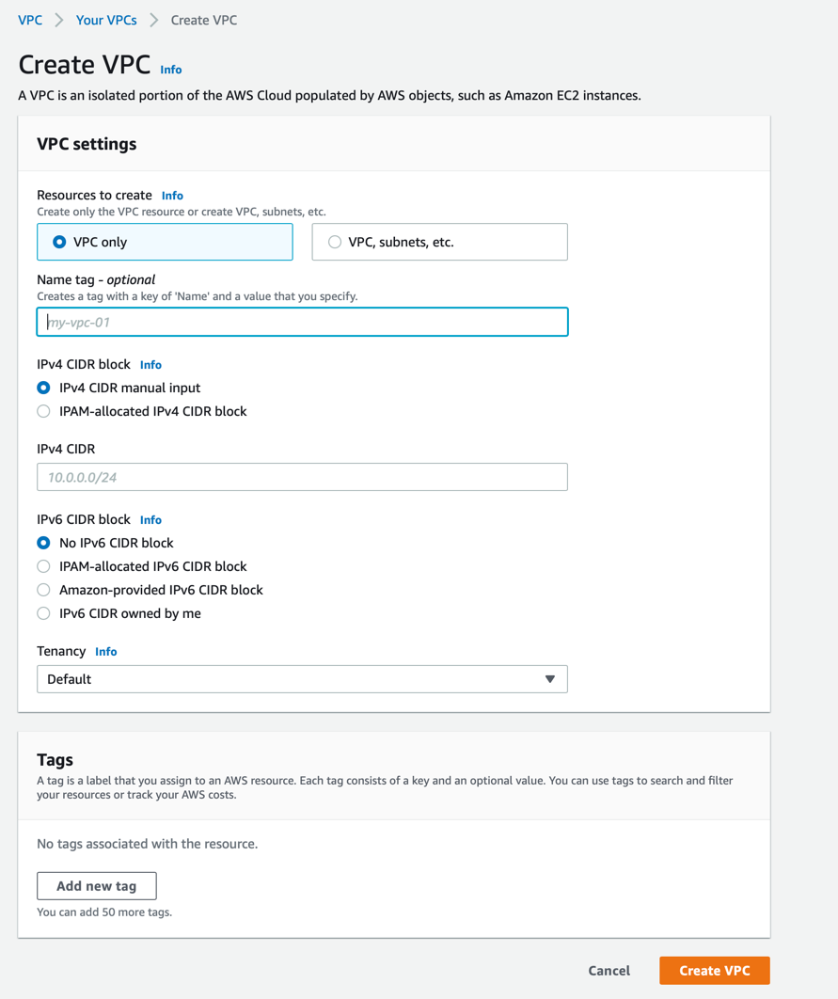
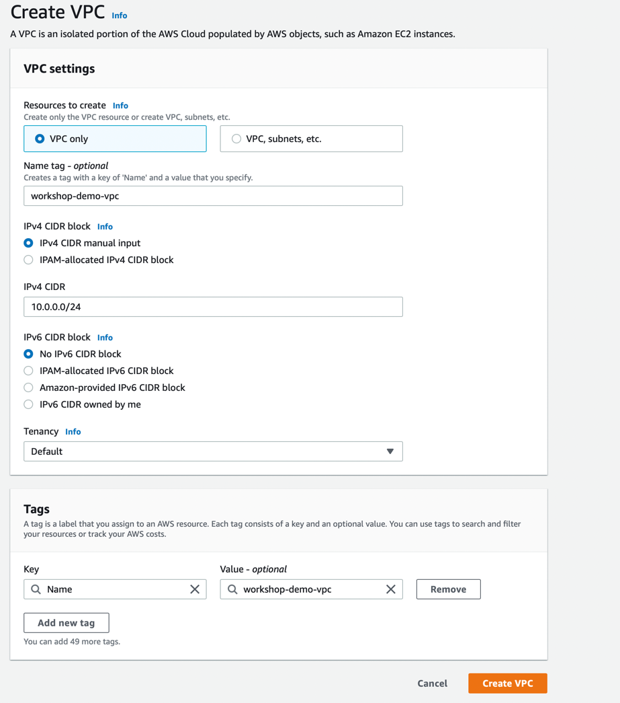
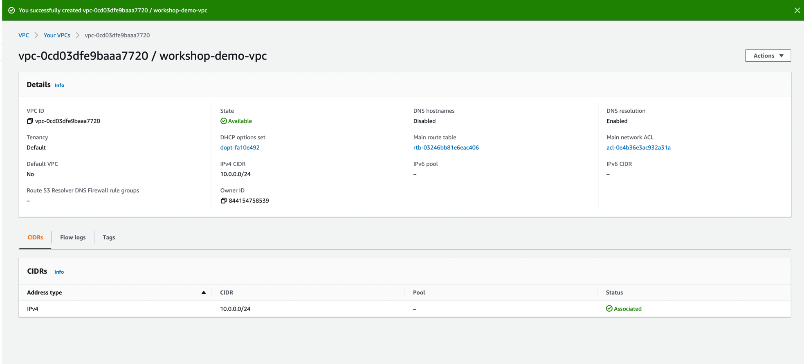
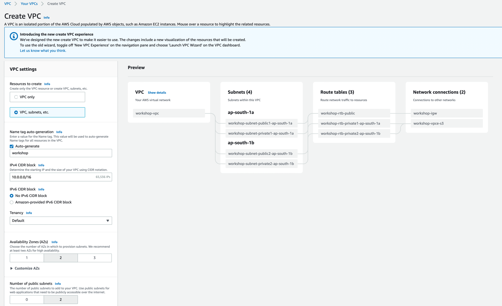
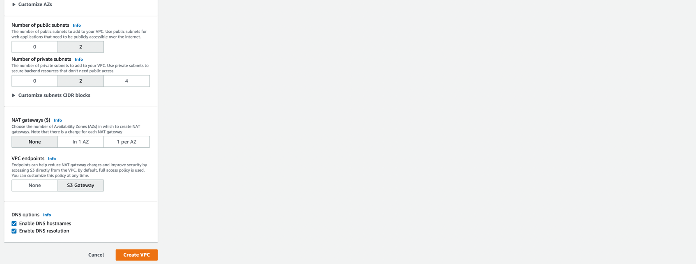
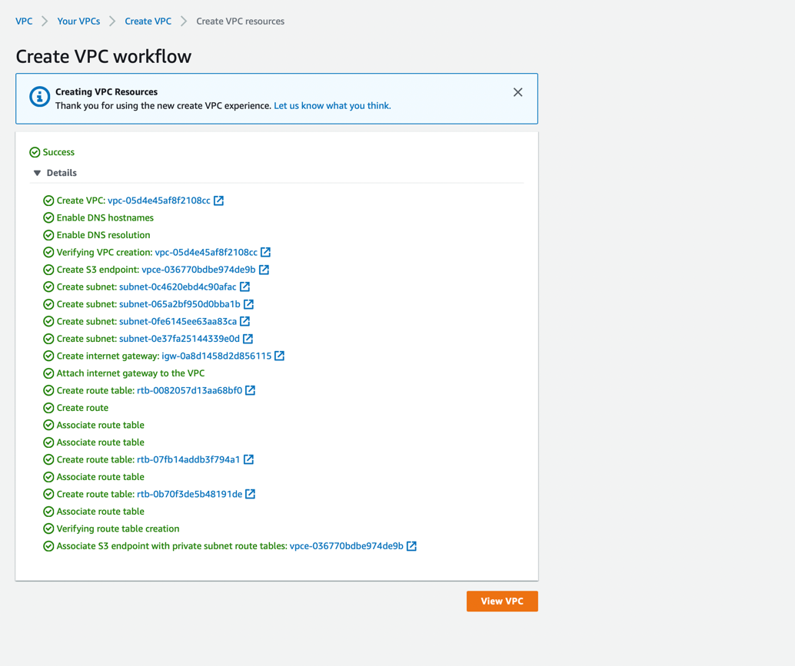

## AWS Networking 
### VPC Overview


### Subnets Overview
### Routing Table 
### NACL 
### Internet Gateway 


## LAB 1.1 - Create VPC (Manual Way) 
### Manual Steps 
1. Go to AWS Console and go to `VPC Wizard`
2. Click on `Create VPC` button


3. Select the option `VPC only`
4. Specify the `VPC Name`
5. For other option, keep the default value as shown in the screenshot below 



6. Click on the `Create VPC` button below and this will create the VPC as shown below




## LAB 1.2 - Create VPC (Terraform Way)
### Create VPC Using Terraform 
1. The documentation url `https://registry.terraform.io/providers/hashicorp/aws/latest/docs/resources/vpc`
2. Create a project structure in directory `lab1.2/` as shown below 
```shell
.
|-- main.tf
|-- outputs.tf
|-- providers.tf
|-- terraform.tfvars
`-- variables.tf

0 directories, 5 files

```
3. Next add the following content to the `providers.tf` as shown below
```terraform
terraform {
  required_version = ">=0.15"
  required_providers {
    aws = {
      source = "hashicorp/aws"
      version = "~>4.10.0"
    }
  }
}

```
4. Next add the following content to the `main.tf` file as shown below
```terraform
resource "aws_vpc" "vpc" {
  cidr_block       = var.vpc_cidr_block
  instance_tenancy = var.instance_tenancy
  tags             = var.tags
}
```
5. Next add the following content to the `variables.tf` file as shown below
```terraform
variable "region" {
  type        = string
  description = "AWS Region in which VPC will be created"
  default     = ""
}

variable "tags" {
  type        = map(string)
  description = "AWS VPC tags "
}

variable "instance_tenancy" {
  type        = string
  description = "VPC Tenancy model"
}

variable "vpc_cidr_block" {
  type        = string
  description = "CIDR Block specified to VPC"
}
```
6. Next add the following content to the `outputs.tf` file as shown below
```terraform
output "vpc_id" {
  value = aws_vpc.vpc.id
}
```
7. Next add the following content to the `terraform.tfvars` as shown below
```terraform
region           = "ap-south-1"
instance_tenancy = "default"
tags = {
  "Name" : "workshop-demo-vpc"
}
vpc_cidr_block = "10.0.0.0/24"
```
8. Then run the following command to create the VPC 
```shell
$ terraform init 

$ terraform fmt 

$ terraform validate 

$ terraform plan 

$ terraform apply --auto-approve 
```
9. Then finally delete the VPC using the following command
```shell
$ terraform destroy --auto-approve 
```

## LAB 1.3 - Create VPC with Subnets (Manual)
### Creating Subnets along with the VPC
1. `Subnet - `A subnet is a range of IP addresses in your VPC 
   1. You launch AWS resources, such as EC2 instances, into subnets
2. `Public Subnet`
   1. Use public subnets for web applications that need to be publicly accessible over the internet
3. `Private Subnet`
   1. Use `private subnets` to secure backend resources that don't need public access.
4. `DNS hostnames` - The DNS hostnames attribute determines whether instances launched in the VPC receive public DNS hostnames that correspond to their public IP addresses.
   1. The DNS resolution attribute determines whether DNS resolution through the Amazon DNS server is supported for the VPC.
5. `NAT Gateways`
   1. A NAT gateway is a Network Address Translation (NAT) service. 
   2. NAT gateways enable resources in private subnets to reach the internet. 
   3. External services, however, cannot initiate a connection with the resources in the private subnets.
   4. If you choose to create a NAT gateway in your VPC, you are charged for each hour that your NAT gateway is provisioned and available. 
   5. You are also charged for the amount of data that passes through the gateway.
   6. Choose the number of Availability Zones (AZs) in which to create NAT gateways. Note that there is a charge for each NAT gateway
6. `VPC Endpoint`
   1. A VPC endpoint enables you to privately connect your VPC to supported AWS services like Amazon S3. 
   2. VPC endpoints enable you to create an isolated VPC that is closed from the public internet. 
   3. In addition, there is no additional charge for using gateway endpoints (which helps avoid the costs associated with NAT gateways).
   4. Endpoints can help reduce NAT gateway charges and improve security by accessing S3 directly from the VPC. 
   5. By default, full access policy is used. You can customize this policy at any time.
7. Next go to the `VPC Wizard` and click on `Create VPC` button and then fill the form as shown below






8. Next click on the `Create VPC` button and you can see the following




## VPC Endpoints or NAT Gateway
### Concepts 
1. https://ngoyal16.medium.com/vpc-endpoints-or-nat-gateway-d78430b15b1e
2. https://docs.aws.amazon.com/vpc/latest/privatelink/vpc-endpoints.html
3. https://devops.lv/2021/11/12/aws-private-link-chose-right-strategy-for-your-vpc-endpoints/
4. 

## LAB 1.4 - Create VPC with Subnets (Terraform Way)
### VPC With Subnets
1. Create a directory `lab1.4/` with the following structure
```shell
.
|-- main.tf
|-- outputs.tf
|-- providers.tf
|-- terraform.tfvars
`-- variables.tf

0 directories, 5 files

```
2. Follow the sequence of steps 
   1. Create `VPC`
   2. Create `Intenet Gateway`
   3. Create `Public Subnet`
      1. Map public ip on launch to true 
   4. Create `Elastic IP`
   5. Create `NAT Gateway`
   6. Create `Public Route Table`
   7. Create `AWS Route` to internet 
   8. Associate `Route tables` to Public Subnet 
   9. Create `Private Subnet`
      1. Map public ip on launch attribute to false
   10. Create `Private Route Table`
   11. Create `Private Route` to access Internet
   12. Associate `Route tables` to private subnet
3. Add the following configuration to `main.tf` for the `vpc` resource
```terraform

```
4. Add the following configuration to `main.tf` for the `Internet Gateway` resource 
5. Add the following configuration to `main.tf` for the `Public Subnet` resource 
6. 


## Compute Services 
### Compute Services Overview 


## LAB 2.1 - Create EC2 Instance (manual)

## LAB 2.2 - Create EC2 Instance (Terraform Way)

## LAB 2.3 - Users Data Concept 

## LAB 2.4 - Deploy Nginx App on EC2

## LAB 2.5 -  Two EC2 Instances on two different Subnets 


## AWS Lambda 
### Lamdba Overview 
1. steps


## LAB 2.1 - Hello World Demo 
### Overview
1. Create a simple `Hello World` lambda function using `node.js` 
2. Create a file named `hello_world.js` with the following contents
```javascript
exports.handler = async (event, context) => {
    console.log('Received event: ' + JSON.stringify(event, null, 2));
}
```
3. ff

## LAB 1.1 